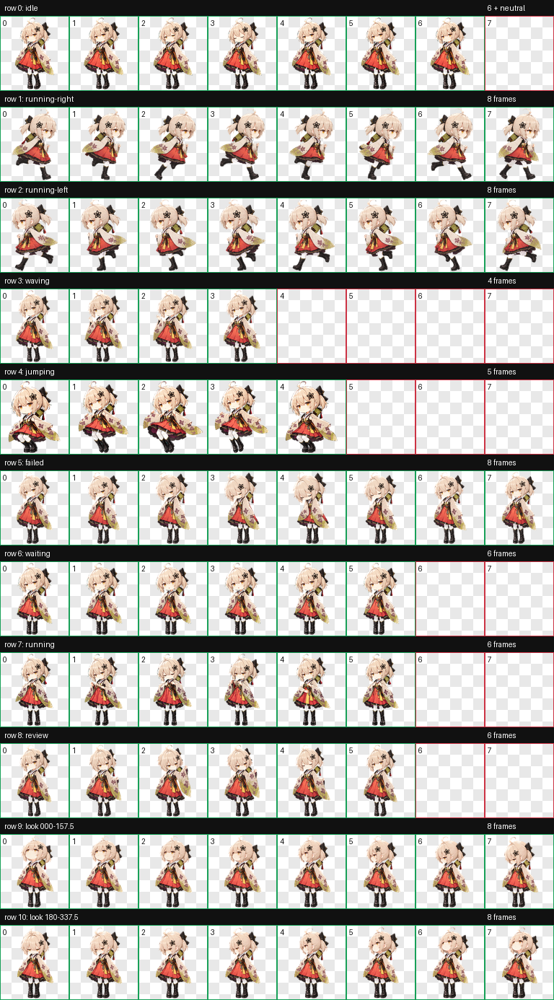

# 稀音·别枝 Codex Pet

以《明日方舟》干员“稀音”的 EPOQUE 时装“别枝”和基建小人比例为参考制作的 Codex v2 动画宠物。

[返回项目总览](../README.md)



## 安装

1. 创建宠物目录 `~/.codex/pets/scene-biezhi/`。
2. 将本目录中的 `pet.json` 和 `spritesheet.webp` 一起复制到该目录。
3. 重新打开 Codex；宠物名称将显示为“稀音·别枝”。

## 项目内容

```text
.
├── pet.json                 # Codex pet 配置
├── spritesheet.webp         # 最终 v2 动画图集
├── validation.json          # 最终结构校验结果
├── preview/
│   ├── contact-sheet.png    # 全部动作总览
│   └── look-directions.png  # 16 个视线方向检查图
└── source/                  # 完整制作工程
    ├── decoded/             # 生成并选定的动作条
    ├── frames/              # 提取后的逐帧 PNG
    ├── final/               # 图集及校验产物
    ├── prompts/             # 各动作生成提示词
    ├── qa/                  # 方向、连续性和视觉 QA
    ├── references/          # 参考图与布局模板
    ├── imagegen-jobs.json   # 生成任务清单
    ├── pet_request.json     # 制作请求与图集规格
    └── progress.md          # 制作记录
```

## 技术规格

- Codex `spriteVersionNumber: 2`
- 图集尺寸：`1536 × 2288`
- 单格尺寸：`192 × 208`
- 布局：8 列 × 11 行
- 动画：9 组标准动作
- 视线：16 个顺时针方向
- 格式：带透明通道的 WebP

## 验证

`validation.json` 的结果为 `ok: true`，且无错误或警告。`preview/` 和 `source/qa/` 中保留了动作总览、方向语义、相邻方向连续性及视觉检查产物。

## 参考与声明

参考页面：

- [PRTS Wiki：稀音](https://prts.wiki/w/%E7%A8%80%E9%9F%B3)
- [明日方舟中文 Wiki：稀音](https://wiki.biligame.com/arknights/%E7%A8%80%E9%9F%B3)

本项目为非官方同人制作，不代表或隶属于官方。角色设计、《明日方舟》及相关素材的权利归上海鹰角网络科技有限公司及其关联方所有。由于项目包含第三方角色的衍生图像，本目录不附带开源许可证；上传、公开或再分发前，请自行确认适用平台的规则及权利要求。详见 [`NOTICE.md`](NOTICE.md)。
