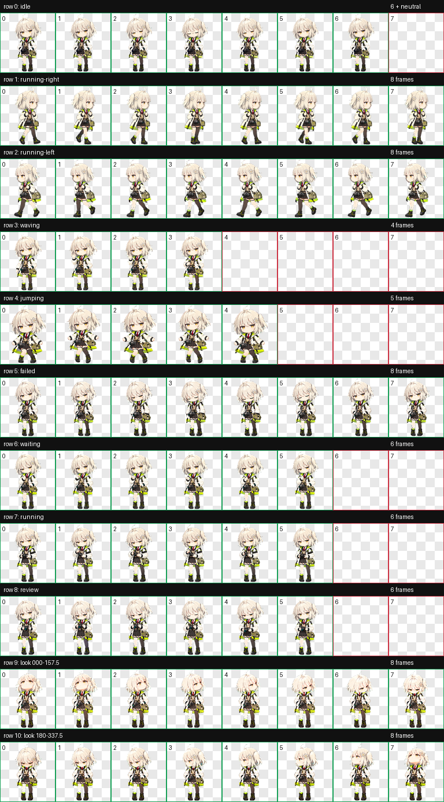

# 稀音 Codex Pet

以《明日方舟》干员“稀音”的原版服装和基建小人比例为参考制作的 Codex v2 动画宠物。
## 仓库中的宠物

- 根目录：稀音（原版服装），宠物 ID `scene`
- [scene-biezhi/](scene-biezhi/)：稀音·别枝，宠物 ID `scene-biezhi`




## 使用

将仓库根目录下的 `pet.json` 和 `spritesheet.webp` 一起复制到：

```text
~/.codex/pets/scene/
```

重新打开 Codex 后，宠物名称显示为“稀音”。

## 文件结构

```text
.
├── pet.json                 # Codex pet 配置
├── spritesheet.webp         # 最终 8×11、v2 动画图集
├── validation.json          # 最终结构校验结果
├── preview/
│   ├── contact-sheet.png    # 全部动作总览
│   └── look-directions.png  # 16 个视线方向检查图
└── source/                  # 完整制作工程
    ├── decoded/             # imagegen 生成的动作条
    ├── frames/              # 提取后的逐帧 PNG
    ├── final/               # 图集及校验产物
    ├── prompts/             # 各动作生成提示词
    ├── qa/                  # 盲审、连续性和视觉 QA
    ├── references/          # 参考图与布局模板
    ├── imagegen-jobs.json   # 生成任务清单
    ├── pet_request.json     # 制作请求与图集规格
    └── progress.md          # 制作记录
```

## 技术规格

- Codex `spriteVersionNumber: 2`
- 图集尺寸：`1536 × 2288`
- 单格尺寸：`192 × 208`
- 布局：8 列 × 11 行
- 9 组标准动作
- 16 个顺时针视线方向
- WebP RGBA，透明背景

`validation.json` 中的 `ok` 为 `true`。完整工程还包含三轮隔离方向盲审、逐方向语义检查、相邻方向连续性检查和动作预览。

## 参考与声明

角色设计和《明日方舟》相关权利归上海鹰角网络科技有限公司及其关联方所有。本仓库是非官方同人制作，不代表或隶属于官方。参考页面：

- https://wiki.biligame.com/arknights/稀音
- https://prts.wiki/w/稀音/spine

由于内容包含第三方角色的衍生图像，本仓库不附带开源许可证。上传、公开和再分发前，请自行确认适用平台规则及权利要求。

